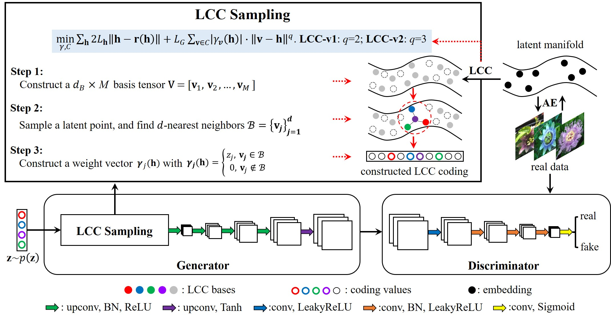

# LCCGAN-v2

Pytorch implementation for “Improving Generative Adversarial Networks with Local Coordinate Coding”.

* AutoEncoder (AE) learns the embeddings on the latent manifold.

* Local Coordinate Coding (LCC) learns local coordinate systems. Specifically, we train LCCGAN-v1 with q=2 and LCCGAN-v2 with q=3.

* The LCC sampling method is conducted on the latent manifold.

* The LCCGAN is a general framework that can be applied to different GAN methods.

## Dependencies

python 2.7

Pytorch 0.4

## Dataset

In our paper, to sample different images, we train our model on four datasets, respectively.

* Download [MNIST][3] dataset.

* Download [Oxford-102 Flowers][4] dataset.

* Download [Large-scale CelebFaces Attributes (CelebA)][5] dataset.

* Download [Large-scale Scene Understanding (LSUN)][6] dataset.

## Training

* Train LCCGAN-v2 on MNIST dataset.

    * python trainer.py --dataset mnist --dataroot ./mnist --nc 1

* Train LCCGAN-v2 on Oxford-102 Flowers dataset.

    * python trainer.py --dataset Oxford-102 --dataroot your_images_folder

* If you want to train the model on Large-scale CelebFaces Attributes (CelebA), Large-scale Scene Understanding (LSUN) or your own dataset. Just replace the hyperparameter like these:

    * python trainer.py --dataset name_o_dataset --dataroot path_of_dataset

## Citation

    @InProceedings{pmlr-v80-cao18a,
      title = 	 {Adversarial Learning with Local Coordinate Coding},
      author = 	 {Cao, Jiezhang and Guo, Yong and Wu, Qingyao and Shen, Chunhua and Huang, Junzhou and Tan, Mingkui},
      booktitle = 	 {Proceedings of the 35th International Conference on Machine Learning},
      pages = 	 {707--715},
      year = 	 {2018},
      editor = 	 {Dy, Jennifer and Krause, Andreas},
      volume = 	 {80},
      series = 	 {Proceedings of Machine Learning Research},
      address = 	 {Stockholmsmässan, Stockholm Sweden},
      month = 	 {10--15 Jul},
      publisher = 	 {PMLR}
    }
